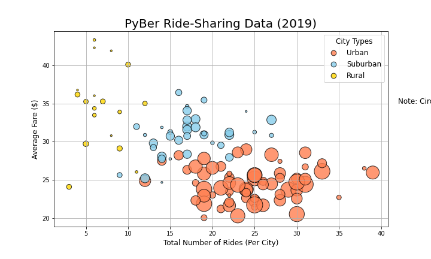
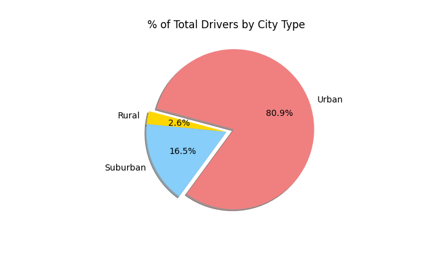
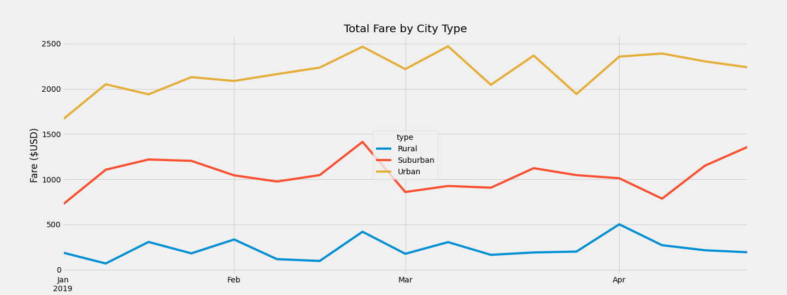

# PyBear Analysis 

## Overview of PyBear Analysis 
PyBer, a python base ride-sharing app company. V. Isualize has given me and Omar a brand-new assignment examining how the data differs by city type and how those differences can be used by decision-makers at PyBer. The analysis conducted: 

1. Perform an exploratory analysis on data in large csv files.
2. Create several types of visualizations to tell a story about the data.
3. Create charts to show the relationship between the type of city, and the number of drivers and riders as well as the percentage of total fares, riders and drivers by type of city. 
4. Create a multiple-line graph that shows the total weekly fares for each city type. 
5. The analysis will help PyBer improve access to ride-sharing services and determine affordability for underserved neighborhoods

## Resources

-Data Sources: 
    - [city_data.csv](Resources/city_data.csv)
    - [ride_data.csv](Resources/ride_data.csv)
    

## Software

1. Python 3.7 
2. Jupyter Notebook
3. Pandas
4. Matplotlib 3.34

## PyBear Analysis Results 
The data shows different trends based on city type. Please see the differences in results based on city type in the chart. 

### Total Rides
We see a highest number of riders per city in Urban type cities. Suburban cities have around 10-20 total number of riders per city. Rural cities have the least amount of total number of riders per city. 

Please see the following graph showing the total ride count by city type. 

Please see the following graph showing how total rides is split up by city type. 

### Total Drivers
When there is higher demand there must be higher supply. We see the trend of total drivers to mirror the trend of total rides. We see the highest number of divers per city in Urban types cities followed by Suburban cities and lastly Rural cities. 

Please see the following graph showing the total driver count by city type. 

Please see the following graph showing how total driver is split up by city type. 

### Total Fares and Average Fare Per Ride and Driver
The average fare per rider and driver is higher in Rural and Suburban cities compared to Urban cities. The lower demand and supply may cause the services to be more expensive in Rural areas. 

Please see the following graph showing total fare price by city type. 

Please see the following graph showing how total fare is split up by city type. 

### Total Fare By City Type 
The total fare is highest for Urban areas since Urban cities have the highest number of riders and driver. We see in the graph below that the total fare over time for all three city type remains fairly consistent in range of total fare. We also see that Urban cities consistently generates the highest total fare compared to Suburban and Rural cities. 

## PyBear Analysis Summary 
The data provides evidence that trends differ based on city type. It is important to consider city type when making decisions about the app moving forward. Below are recommendations based off the trends seen in the data. 

1. Since we see higher usage and higher revenue produced from the app in Urban cities, it is important to allocate more resources and infrastructure to the app to accommodate the higher demand.   
2. The average fare in Rural and Suburban areas are higher compared to Urban cities. The higher prices may cause a barrier of entry for riders and it might be valuable to further analyze why Urban areas have a lower average fare. Further analyze may include looking into the average fare by mileage. 
3. Lastly, we see spikes in total fares across all three city types around the end of February. It is valuable to note that demand is higher during the wintertime when people might be more willing to pay for a ride. 

